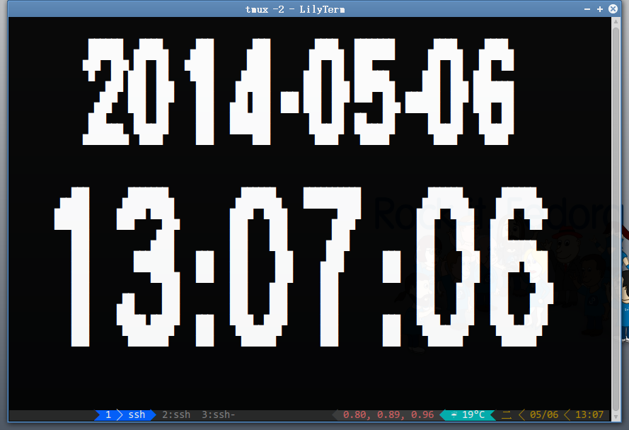

GD Clock
========
A console mode clock using GD graphics library

Usage
-----
    # ./gd_clock --help

    # ./clock.sh

Screentshots
------------

Author
------
    SHIE, Li-Yi <lyshie@mx.nthu.edu.tw>

License
-------
    GNU General Public License (GPL)
